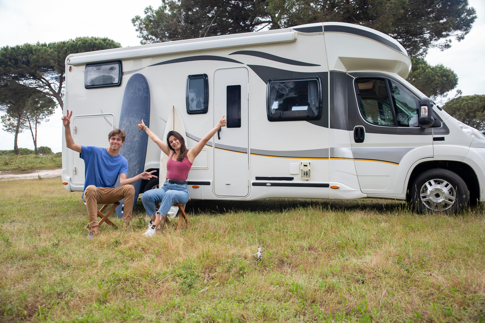
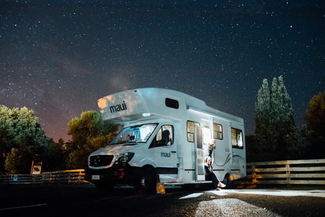

# CamperClub Website





## Description

This project is a camper rental website that allows users to browse available campers, view detailed information about each camper, and add campers to their favorites. The site works correctly on the local server, and issues with errors when deploying on GitHub Pages have been resolved.

## Features

- **Browse Campers**: Users can browse a list of available campers with images, prices, and other details.
- **Camper Details**: Each camper has a dedicated page with detailed information, including description, location, rating, reviews, and specifications.
- **Add to Favorites**: Users can add campers to their favorites list and remove them from it.

## Libraries Used


<a href="https://www.npmjs.com/package/@emotion/react">
    
</a>
<a href="https://www.npmjs.com/package/@emotion/styled">
    
</a>
<a href="https://www.npmjs.com/package/@mui/material">
    
</a>
<a href="https://www.npmjs.com/package/@reduxjs/toolkit">
    
</a>
<a href="https://www.npmjs.com/package/axios">
    
</a>
<a href="https://www.npmjs.com/package/formik">
    
</a>
<a href="https://www.npmjs.com/package/react">
    
</a>
<a href="https://www.npmjs.com/package/react-dom">
    
</a>
<a href="https://www.npmjs.com/package/react-loader-spinner">
    
</a>
<a href="https://www.npmjs.com/package/react-redux">
    
</a>
<a href="https://www.npmjs.com/package/react-router-dom">
    
</a>
<a href="https://www.npmjs.com/package/react-toastify">
    
</a>

## Running the Project

1. Clone the repository:
   ```bash
   git clone https://github.com/your-repo/camper-rental.git

## Install dependencies:

bash

cd camper-rental
npm install

## Start the project:

bash

npm run dev


License
This project is licensed under the MIT License.


Please replace `your-repo` with the actual URL of your GitHub repository. This README.md file will help users understand the functionality of your project and easily install all the necessary dependencies.
